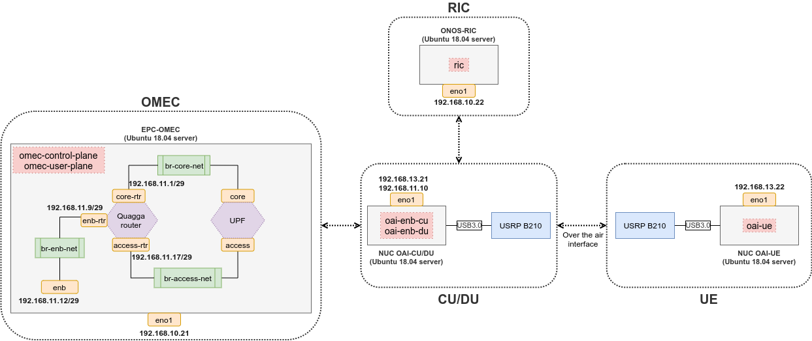

<!--
SPDX-FileCopyrightText: 2019-present Open Networking Foundation <info@opennetworking.org>

SPDX-License-Identifier: Apache-2.0
-->

# Hardware Installation

This installation shows how to run the ONF SDRAN setup using ONOS-RIC, OMEC, and OAI CU/DU and UE components. 
The OAI components perform connection via USRP B210 radio equipment attached to NUC machines.
This setup can be utilized as a reference implementation of the ONOS-RIC in hardware.

Prepare two NUC machines, each installed with a Ubuntu 18.04 server Operating System.
One NUC machine will be used to run a UE setup connected to a USRP B210. The other NUC machine will be used to run the eNodeB OAI components (CU/DU) connected to another B210 device.
Prepare other two machines (or Virtual Machines - VMs) to install decomposed parts the sdRan-in-a-Box (RiaB), in one of them the RIC (ONOS-RIC) will be executed, while in the other the EPC (OMEC) will be executed - both over Kubernetes.
**Those machines (or VMs) should be connected into the same subnet (via a switch or direct connection). In all machines install Ubuntu 18.04 server first.**

*NOTE: In the below sections, we have the following IP addresses assigned: NUC-OAI-CU/DU (192.168.13.21), NUC-UE (192.168.13.22), ONOS-RIC (192.168.10.22), and EPC-OMEC (192.168.10.21).
These IP addresses are assigned to the eno1 interface in each server, i.e., the interface associated with the default gateway route. In case of a custom setup with different IP addresses assigned to the VMs, make sure the IP addresses (and their subnets/masks) are properly referenced in the configurations utilized in this tutorial. The NUC-UE machine only needs an IP address for the setup of the OAI software requirements and components.*

When complete, the hardware installation detains the settings shown in the following diagram:



In the diagram above are presented the 4 machines described in this setup (NUC OAI-CU/DU, NUC OAI-UE, ONOS-RIC, EPC-OMEC) interconnected via a logical layer 2 network. In each represented machine, the red squared items represent the components instantiated on them using RiaB. In particular, the EPC-OMEC machine highlights the internal structure of the omec-user-plane components, presenting how the UPF and Quagga router are interconnected via different (Open vSwitch) bridges to perform the user plane communication of the EPC. Notice, the UE component is represented by a NUC OAI-UE, likewise it could be replaced by a LTE handset.

In addition, this setup has three internal subnets: (i) enb subnet - 192.168.11.8/29, (ii) core subnet - 192.168.11.0/29, and (iii) access subnet - 192.168.11.16/29. The enb subnet is to make a connection between CU/DU machine and Quagga internal router in OMEC machine. The core subnet is for S1u interface whereas the access subnet is for Sgi interface.

## Get the RiaB source code 
To get the source code, please see: `https://github.com/onosproject/sdran-in-a-box`.

Since SDRAN-in-a-Box repository is a member-only repository, a user should log in github and then check the git clone command on that web site.

**Clone the RiaB repository to all the machines EPC-OMEC, ONOS-RIC, OAI-CU/DU, OAI-UE.**.

In all the machines, after downloading the source code, in the cloned source code folder, edit the sdran-in-a-box-values.yaml file and change the file as below (we can copy and paste).

## Change sdran-in-a-box-values yaml file

In the cloned source code of the folder sdran-in-a-box, overwrite the content of the file sdran-in-a-box-values.yaml as provided below (copy and paste).

```yaml
# Copyright 2020-present Open Networking Foundation
#
# SPDX-License-Identifier: Apache-2.0

# cassandra values
cassandra:
  config:
    cluster_size: 1
    seed_size: 1

resources:
  enabled: false

config:
  spgwc:
    pfcp: true
    multiUpfs: true
    jsonCfgFiles:
      subscriber_mapping.json:
        subscriber-selection-rules:
          - selected-user-plane-profile: "menlo"
            keys:
              serving-plmn:
                mcc: 315
                mnc: 10
                tac: 1
            priority: 5
            selected-access-profile:
              - access-all
            selected-apn-profile: "apn-internet-menlo"
            selected-qos-profile: "qos-profile1"
        user-plane-profiles:
          menlo:
            user-plane: "upf.riab.svc.cluster.local"
        apn-profiles:
          apn-internet-default:
            apn-name: "internet"
            usage: 1
            network: "lbo"
            gx_enabled: true
            dns_primary: "1.1.1.1"
            dns_secondary: "8.8.8.8"
            mtu: 1400
          apn-internet-menlo:
            apn-name: "internet"
            usage: 1
            network: "lbo"
            gx_enabled: true
            dns_primary: "8.8.8.8"
            dns_secondary: "1.1.1.1"
            mtu: 1400
    ueIpPool:
      ip: 172.250.0.0 # if we use RiaB, Makefile script will override this value with the value defined in Makefile script.
  upf:
    enb:
       subnet: 192.168.11.8/29 # This is the same subnet defined in the setup, check the note at the end of the page.
    access:
       gateway: 192.168.11.17
       ip: 192.168.11.19/29
    core:
       gateway: 192.168.11.1
       ip: 192.168.11.3/29
    privileged: true
    name: "oaisim"
    sriov:
      enabled: false
    hugepage:
      enabled: false
    cniPlugin: simpleovs
    ipam: static
    cfgFiles:
      upf.json:
        mode: af_packet
  mme:
    address: 192.168.10.21 # Set here the IP address of the interface eno1 (default gw) in the VM where OMEC is executed
    cfgFiles:
      config.json:
        mme:
          mcc:
            dig1: 3
            dig2: 1
            dig3: 5
          mnc:
            dig1: 0
            dig2: 1
            dig3: 0
          apnlist:
            internet: "spgwc"
  hss:
    bootstrap:
      users:
        - apn: "internet"
          key: "000102030405060708090a0b0c0d0e0f"
          opc: "69d5c2eb2e2e624750541d3bbc692ba5"
          sqn: 96
          imsiStart: "315010206000001"
          msisdnStart: "1122334455"
          count: 30
      mmes:
        - id: 1
          mme_identity: mme.riab.svc.cluster.local
          mme_realm: riab.svc.cluster.local
          isdn: "19136246000"
          unreachability: 1
  oai-enb-cu:
    networks:
      f1:
        interface: eno1 # if we use RiaB, Makefile script will automatically apply appropriate interface name
        address: 10.128.100.100 #if we use RiaB, Makefile script will automatically apply appropriate IP address
      s1mme:
        interface: eno1 # if we use RiaB, Makefile script will automatically apply appropriate interface name
        address: 192.168.13.21 # This is the primary IP address defined to the OAI-CU/DU machine - see `Install OAI CU/DU`
      s1u:
        interface: eno1
        address: 192.168.11.10 # This is the secondary IP address defined to the OAI-CU/DU machine - see `Install OAI CU/DU`
    plmnID:
      mcc: "315"
      mnc: "010"
      length: 3
      fullName: "ONF SDRAN"
      shortName: "SDRAN"
  oai-enb-du:
    enableUSRP: true
    mode: nfapi #or local_L1 for USRP and BasicSim
    networks:
      f1:
        interface: eno1 #if we use RiaB, Makefile script will automatically apply appropriate IP address
        address: 10.128.100.100 #if we use RiaB, Makefile script will automatically apply appropriate IP address
      nfapi:
        interface: eno1 #if we use RiaB, Makefile script will automatically apply appropriate IP address
        address: 10.128.100.100 #if we use RiaB, Makefile script will automatically apply appropriate IP address
  oai-ue:
    enableUSRP: true
    networks:
      nfapi:
        interface: eno1 #if we use RiaB, Makefile script will automatically apply appropriate IP address
        address: 10.128.100.100 #if we use RiaB, Makefile script will automatically apply appropriate IP address
    sim:
      msinStart: "206000001" 
      apiKey: "000102030405060708090a0b0c0d0e0f"
      opc: "69d5c2eb2e2e624750541d3bbc692ba5"
      msisdnStart: "1122334455"
  onos-e2t:
    enabled: "yes"
    networks:
      e2:
        address: 192.168.10.22 # Set here the IP address of the interface eno1 (default gw) in the VM where RIC is executed
        port: 36421

# for the development, we can use the custom images
# For ONOS-RIC
# onos-topo:
#   image:
#     pullPolicy: IfNotPresent
#     repository: onosproject/onos-topo
#     tag: latest
# onos-config:
#   image:
#     pullPolicy: IfNotPresent
#     repository: onosproject/onos-config
#     tag: latest
onos-e2t:
  service:
    external:
      enabled: true
    e2:
     nodePort: 36421
#   image:
#     pullPolicy: IfNotPresent
#     repository: onosproject/onos-e2t
#     tag: latest
# onos-e2sub:
#   image:
#     pullPolicy: IfNotPresent
#     repository: onosproject/onos-e2sub
#     tag: latest
# onos-cli:
#   image:
#     pullPolicy: IfNotPresent
#     repository: onosproject/onos-cli
#     tag: latest
# ran-simulator:
#   image:
#     pullPolicy: IfNotPresent
#     repository: onosproject/ran-simulator
#     tag: latest
# onos-kpimon-v1:
#   image:
#     pullPolicy: IfNotPresent
#     repository: onosproject/onos-kpimon
#     tag: latest
# onos-kpimon-v2:
#   image:
#     pullPolicy: IfNotPresent
#     repository: onosproject/onos-kpimon
#     tag: latest
# onos-pci:
#   image:
#     pullPolicy: IfNotPresent
#     repository: onosproject/onos-pci
#     tag: latest
# fb-ah-xapp:
#   image:
#     repository: onosproject/fb-ah-xapp
#     tag: 0.0.1
#     pullPolicy: IfNotPresent
# fb-ah-gui:
#   image:
#     repository: onosproject/fb-ah-gui
#     tag: 0.0.1
#     pullPolicy: IfNotPresent
# ah-eson-test-server:
#   image:
#     repository: onosproject/ah-eson-test-server
#     tag: 0.0.1
#     pullPolicy: IfNotPresent

# For OMEC & OAI
images:
  pullPolicy: IfNotPresent
  tags:
# For OMEC - Those images are stable image for RiaB
# latest Aether helm chart commit ID: 3d1e936e87b4ddae784a33f036f87899e9d00b95
#    init: docker.io/omecproject/pod-init:1.0.0
#    depCheck: quay.io/stackanetes/kubernetes-entrypoint:v0.3.1
    hssdb: docker.io/onosproject/riab-hssdb:v1.0.0
    hss: docker.io/onosproject/riab-hss:v1.0.0
    mme: docker.io/onosproject/riab-nucleus-mme:v1.0.0
    spgwc: docker.io/onosproject/riab-spgw:v1.0.0
    pcrf: docker.io/onosproject/riab-pcrf:v1.0.0
    pcrfdb: docker.io/onosproject/riab-pcrfdb:v1.0.0
    bess: docker.io/onosproject/riab-bess-upf:v1.0.0
    pfcpiface: docker.io/onosproject/riab-pfcpiface:v1.0.0
# For OAI
    oaicucp: docker.io/onosproject/oai-enb-cu:v0.1.6
    oaidu: docker.io/onosproject/oai-enb-du:v0.1.6
    oaiue: docker.io/onosproject/oai-ue:v0.1.6

# For SD-RAN Umbrella chart:
# ONOS-KPIMON xAPP is imported in the RiaB by default
import:
  onos-uenib:
    enabled: true
  onos-kpimon:
    enabled: true
  onos-pci:
    enabled: false
  onos-mlb:
    enabled: false
# Other ONOS-RIC micro-services
#   onos-topo:
#     enabled: true
#   onos-e2t:
#     enabled: true
#   onos-e2sub:
#     enabled: true
#   onos-o1t:
#     enabled: false
#   onos-config:
#     enabled: true
#   onos-cli:
#     enabled: true
# ran-simulator chart is automatically imported when pushing ransim option
#   ran-simulator:
#     enabled: false
#   onos-gui:
#     enabled: false
#   nem-monitoring:
#     enabled: false
# fb-ah-xapp, fb-ah-gui, and ah-eson-test-server are automatically imported when pushing fbc-pci option
#   fb-ah-xapp:
#     enabled: false
#   fb-ah-gui:
#     enabled: false
#   ah-eson-test-server:
#     enabled: false
```

*Note: The IP addresses prefix (i.e., 192.168.x.z) correspond to the prefix assigned to the same subnet where the whole setup is defined. In a custom setup, make sure these IP addresses subnet match too.*

## Change MakefileVar.mk file
In the sdran-in-a-box directory, we can find `MakefileVar.mk` file. We should change that file accordingly. Go to the last block and change it as follows:
```
# For RIC
E2_F1_CU_INTERFACE				:= cu_e2f1_if
E2_F1_CU_IPADDR					:= 192.168.200.21/24
E2_F1_DU_INTERFACE				:= du_e2f1_if
E2_F1_DU_IPADDR					:= 192.168.200.22/24
S1MME_CU_INTERFACE				:= $(shell ip -4 route list default | awk -F 'dev' '{ print $$2; exit }' | awk '{ print $$1 }')
NFAPI_DU_INTERFACE				:= $(shell ip -4 route list default | awk -F 'dev' '{ print $$2; exit }' | awk '{ print $$1 }')
NFAPI_DU_IPADDR					:= $(shell ip -4 a show $(NFAPI_DU_INTERFACE) | grep inet | awk '{print $$2}' | awk -F '/' '{print $$1}' | tail -n 1)
NFAPI_UE_INTERFACE				:= $(shell ip -4 route list default | awk -F 'dev' '{ print $$2; exit }' | awk '{ print $$1 }')
NFAPI_UE_IPADDR					:= $(shell ip -4 a show $(NFAPI_UE_INTERFACE) | grep inet | awk '{print $$2}' | awk -F '/' '{print $$1}' | tail -n 1)
E2T_NODEPORT_INTERFACE			:= eno1
E2T_NODEPORT_IPADDR				:= 192.168.10.22
E2_F1_BRIDGE_NAME				:= br-e2f1-net

# For routing configuarion
ENB_SUBNET                  := 192.168.11.8/29
ENB_GATEWAY                 := 192.168.11.9/29
ACCESS_SUBNET               := 192.168.11.16/29
UPF_ACCESS_NET_IP           := 192.168.11.19/29
ACCESS_GATEWAY              := 192.168.11.17/29
CORE_SUBNET                 := 192.168.11.0/29
UPF_CORE_NET_IP             := 192.168.11.3/29
CORE_GATEWAY                := 192.168.11.1/29
OAI_ENB_NET_IP              := 192.168.11.10/29
OAI_MACHINE_IP              := 192.168.13.21/16
OAI_ENB_NET_INTERFACE       := $(shell ip -4 route list default | awk -F 'dev' '{ print $$2; exit }' | awk '{ print $$1 }')
OMEC_ENB_NET_IP             := 192.168.11.12/29
OMEC_DEFAULT_INTERFACE      := $(shell ip -4 route list default | awk -F 'dev' '{ print $$2; exit }' | awk '{ print $$1 }')
OMEC_MACHINE_IP             := 192.168.10.21/29
```

*Note: please do not forget to write the subnet mask at the end of IP address or subnet.*

## Vagrantfiles (optional)
For this hardware installation over VMs not baremetal server directly, RiaB supports Vagrantfiles for RIC, RAN, and OMEC.
By using the below commands, we can deploy VMs on the single baremetal server (host machine).
```
# install virsh qemu, etc
host$ sudo apt install qemu-kvm libvirt-bin bridge-utils virt-manager openvswitch-switch -y
host$ sudo apt install qemu libvirt-daemon-system libvirt-clients libxslt-dev libxml2-dev libvirt-dev zlib1g-dev ruby-dev ruby-libvirt ebtables dnsmasq-base -y

# Vagrant install
host$ curl -fsSL https://apt.releases.hashicorp.com/gpg | sudo apt-key add -
host$ sudo apt-add-repository "deb [arch=amd64] https://apt.releases.hashicorp.com $(lsb_release -cs) main"
host$ sudo apt-get update && sudo apt-get install vagrant -y
host$ vagrant plugin install vagrant-libvirt
host$ vagrant plugin install vagrant-mutate

# OVS install
host$ sudo apt update; sudo apt-get install openvswitch-switch -y

# OVS setup
host$ sudo ovs-vsctl --may-exist add-br br0

# to create VMs
host$ cd /path/to/sdran-in-a-box/vagrant
host$ ./run.vms.sh

# to stop VMs
host$ cd /path/to/sdran-in-a-box/vagrant
host$ ./halt_vms.sh

# to destroy VMs
host$ cd /path/to/sdran-in-a-box/vagrant
host$ ./destroy_vms.sh

# if we want to push a vagrant command
host$ cd /path/to/sdran-in-a-box/vagrant
host$ ./vcmd.sh ric <command> # for RIC VM
host$ ./vcmd.sh ran <command> # for RAN VM
host$ ./vcmd.sh omec <command> # for OMEC VM

# If we want to ssh each VM
host$ cd /path/to/sdran-in-a-box/vagrant
host$ ./vcmd.sh ric ssh # for RIC VM
host$ ./vcmd.sh ran ssh # for RAN VM
host$ ./vcmd.sh omec ssh # for OMEC VM
```

*Note: If we want to deploy VMs on the multiple baremetal servers, we should create OpenVSwitch bridge `br0` for each baremetal server and create a VXLAN tunnel between bridges. Example:*
```
# on the first server
host1$ sudo ovs-vsctl add-port br0 vxlan0 -- set interface vxlan0 type=vxlan options:remote_ip=<host2 IP address>
host1$ sudo ovs-vsctl add-port br0 vxlan0 -- set interface vxlan0 type=vxlan options:remote_ip=<host3 IP address>

# on the second server
host2$ sudo ovs-vsctl add-port br0 vxlan0 -- set interface vxlan0 type=vxlan options:remote_ip=<host1 IP address>

# on the third server
host3$ sudo ovs-vsctl add-port br0 vxlan0 -- set interface vxlan0 type=vxlan options:remote_ip=<host1 IP address>

# then, deploy VMs for appropriate host machines
# e.g., host1 - RIC, host2 - RAN, host3 - OMEC
host1$ ./run_ric_vm.sh

host2$ ./run_ran_vm.sh

host3$ ./run_omec_vm.sh

# if we want to stop VMs
# e.g., host1 - RIC, host2 - RAN, host3 - OMEC
host1$ ./halt_ric_vm.sh

host2$ ./halt_ran_vm.sh

host3$ ./halt_omec_vm.sh

# if we want to destroy VMs
# e.g., host1 - RIC, host2 - RAN, host3 - OMEC
host1$ ./destroy_ric_vm.sh

host2$ ./destroy_ran_vm.sh

host3$ ./destroy_omec_vm.sh
```

