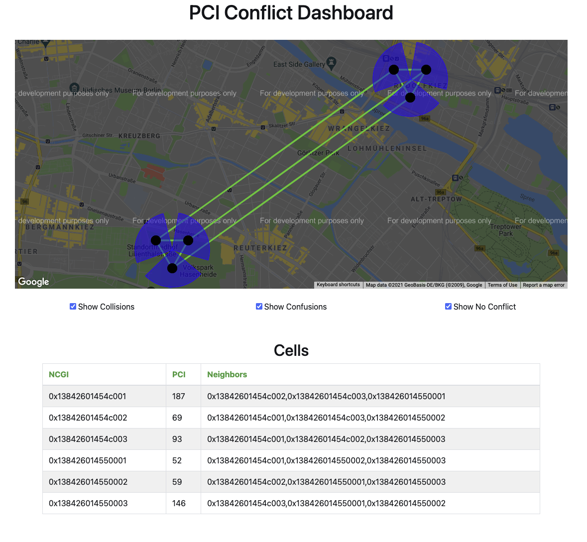
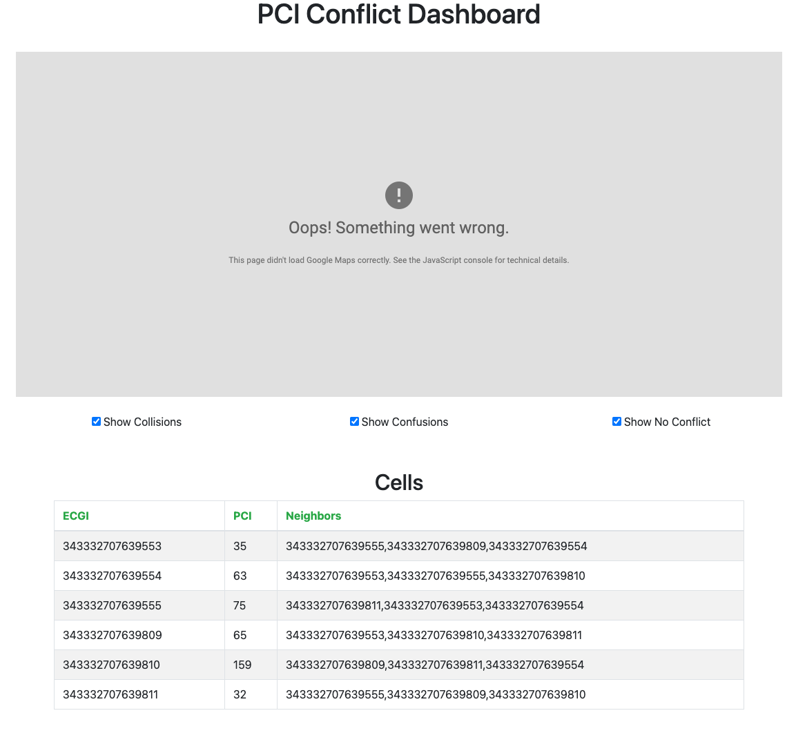
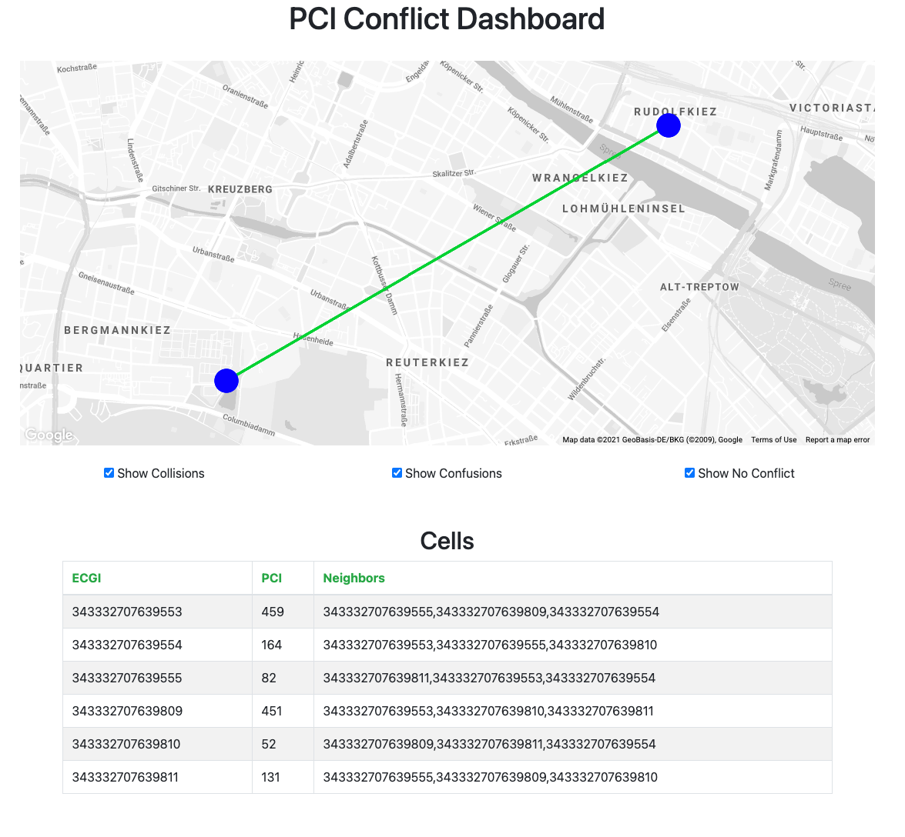

<!--
SPDX-FileCopyrightText: 2019-present Open Networking Foundation <info@opennetworking.org>

SPDX-License-Identifier: Apache-2.0
-->

# Installation with RAN-Simulator and Facebook-AirHop xAPP
This document covers how to install ONOS RIC services with RAN-Simulator and Facebook-Airhop xAPP.
With this option, RiaB will deploy ONOS RIC services including ONOS-KPIMON (KPM 2.0 supported) together with RAN-Simulator and Facebook-AirHop xAPP.

## Clone this repository
To begin with, clone this repository:
```bash
$ git clone https://github.com/onosproject/sdran-in-a-box
```
**NOTE: If we want to use a specific release, we can change the branch with `git checkout [args]` command:**
```bash
$ cd /path/to/sdran-in-a-box
$ git checkout v1.1.0 # for release 1.1
$ git checkout v1.1.1 # for release 1.1.1
$ git checkout v1.2.0 # for release 1.2
$ git checkout v1.3.0 # for release 1.3
$ git checkout v1.4.0 # for release 1.4
$ git checkout master # for master
```

## Deploy RiaB with RAN-Simulator and Facebook-AirHop xAPP
To deploy RiaB with RAN-Simulator and Facebook-AirHop xAPP, we should go to `sdran-in-a-box` directory and command below:
```bash
$ cd /path/to/sdran-in-a-box
# type one of below commands
# for "master-stable" version
$ make riab OPT=fbah VER=stable # or just make riab OPT=fbah
# for "latest" version
$ make riab OPT=fbah VER=latest
# for a specific version
$ make riab OPT=fbah VER=v1.1.0 # for release SD-RAN 1.1
$ make riab OPT=fbah VER=v1.1.1 # for release SD-RAN 1.1.1
$ make riab OPT=fbah VER=v1.2.0 # for release SD-RAN 1.2
$ make riab OPT=fbah VER=v1.3.0 # for release SD-RAN 1.3
$ make riab OPT=fbah VER=v1.4.0 # for release SD-RAN 1.4
# for a "dev" version
$ make riab OPT=fbah VER=dev # for dev version
```

Once we push one of above commands, the deployment procedure starts.

If we don't see any error or failure messages, everything is deployed.
```bash
$ kubectl get po --all-namespaces
NAMESPACE     NAME                                              READY   STATUS    RESTARTS   AGE
kube-system   atomix-controller-99f978c7d-85cpn                 1/1     Running   0          25m
kube-system   atomix-raft-storage-controller-75979cfff8-4bsnz   1/1     Running   0          25m
kube-system   calico-kube-controllers-584ddbb8fb-nxb7l          1/1     Running   0          4h42m
kube-system   calico-node-s5czk                                 1/1     Running   1          4h42m
kube-system   coredns-dff8fc7d-nznzf                            1/1     Running   0          4h42m
kube-system   dns-autoscaler-5d74bb9b8f-cfwvp                   1/1     Running   0          4h42m
kube-system   kube-apiserver-node1                              1/1     Running   0          4h43m
kube-system   kube-controller-manager-node1                     1/1     Running   0          4h43m
kube-system   kube-multus-ds-amd64-r42zf                        1/1     Running   0          4h42m
kube-system   kube-proxy-vp7k7                                  1/1     Running   1          4h43m
kube-system   kube-scheduler-node1                              1/1     Running   0          4h43m
kube-system   kubernetes-dashboard-667c4c65f8-cr6q5             1/1     Running   0          4h42m
kube-system   kubernetes-metrics-scraper-54fbb4d595-t8rgz       1/1     Running   0          4h42m
kube-system   nodelocaldns-rc6w7                                1/1     Running   0          4h42m
kube-system   onos-operator-app-d56cb6f55-stfkb                 1/1     Running   0          24m
kube-system   onos-operator-config-7986b568b-f8dlq              1/1     Running   0          24m
kube-system   onos-operator-topo-76fdf46db5-h2vvd               1/1     Running   0          24m
riab          ah-eson-test-server-ccf5ccf5d-jcmj7               1/1     Running   0          2m52s
riab          fb-ah-gui-64689f6986-tjvpc                        1/1     Running   0          88s
riab          fb-ah-xapp-58b745fcf9-6bgbv                       2/2     Running   0          70s
riab          fb-kpimon-xapp-5c78fd7486-ms6wq                   2/2     Running   2          2m52s
riab          onos-a1t-84db77df99-4klzb                         2/2     Running   0          2m52s
riab          onos-cli-6b746874c8-9cn82                         1/1     Running   0          2m52s
riab          onos-config-7bd4b6f7f6-b24ws                      4/4     Running   0          2m52s
riab          onos-consensus-store-0                            1/1     Running   0          2m51s
riab          onos-e2t-58b4cd867-ljmpr                          3/3     Running   0          2m52s
riab          onos-kpimon-966bdf77f-97pmr                       2/2     Running   0          2m51s
riab          onos-topo-7cc9d754d7-kngj9                        3/3     Running   0          2m51s
riab          onos-uenib-779cb5dbd6-tb7nm                       3/3     Running   0          2m51s
riab          ran-simulator-85b945db79-ltjnd                    1/1     Running   0          2m51s
```

NOTE: If we see any issue when deploying RiaB, please check [Troubleshooting](./troubleshooting.md)

## End-to-End (E2E) tests for verification
In order to check whether everything is running, we should conduct some E2E tests and check their results.
Since RAN-Sim does only generate SD-RAN control messages, we can run E2E tests on the SD-RAN control plane.

### The E2E test on SD-RAN control plane
* `make test-kpimon`: 
```bash
$ make test-kpimon
...
*** Get KPIMON result through CLI ***
Node ID          Cell Object ID       Cell Global ID            Time    RRC.Conn.Avg    RRC.Conn.Max    RRC.ConnEstabAtt.Sum    RRC.ConnEstabSucc.Sum    RRC.ConnReEstabAtt.HOFail    RRC.ConnReEstabAtt.Other    RRC.ConnReEstabAtt.Sum    RRC.ConnReEstabAtt.reconfigFail
e2:1/5153       13842601454c001             1454c001      03:11:28.0               2               2                       0                        0                            0                           0                         0                                  0
e2:1/5153       13842601454c002             1454c002      03:11:28.0               3               3                       0                        0                            0                           0                         0                                  0
e2:1/5153       13842601454c003             1454c003      03:11:28.0               2               2                       0                        0                            0                           0                         0                                  0
e2:1/5154       138426014550001             14550001      03:11:51.0               1               1                       0                        0                            0                           0                         0                                  0
e2:1/5154       138426014550002             14550002      03:11:51.0               2               2                       0                        0                            0                           0                         0                                  0
e2:1/5154       138426014550003             14550003      03:11:50.0               1               1                       0                        0                            0                           0                         0                                  0
```

* Use Facebook-AirHop GUI page: for SD-RAN release 1.1, release 1.1.1, release 1.2, release 1.3, master-stable, latest, and dev versions

### GUI [for SD-RAN release 1.2 and beyond]

To access GUI, we should open web browser like [Chrome](https://www.google.com/chrome/) or [Safari](https://www.apple.com/safari/).
Next, go to `http://<RiaB server IP address>:30095`
Then, we can see the xAPP webpage.



*Note: If we put the mouse cursor over the black circles, some tool tips should pop up.*

*Note: If we want to change the cell's location, please see push-cell-loc.sh file in scripts directory.*

### GUI [for SD-RAN release 1.1 and 1.1.1]

To access GUI, we should open web browser like [Chrome](https://www.google.com/chrome/) or [Safari](https://www.apple.com/safari/).
Next, go to `http://<RiaB server IP address>:30095`
Then, we can see the xAPP webpage.



On this page, we can see the `Cells` table which shows ECGI, PCI, and each cell's neighbor cells.

If we want to see the Google Map View, we should make a SSH tunnel from our local machine to the RiaB server with below command:
```bash
$ ssh <id>@<RiaB server IP address> -L "*:8080:<RiaB server IP address>:30095"
```
After that, go to `http://localhost:8080` on the web browser.



Since the Google Map API only allows us to use the url `localhost:8080` to show Google Map view, we should make the SSH tunnel.

NOTE 1: Of course, all other port forwarding should work as long as we can access the GUI with `localhost:8080` URL.

## Other commands
### Reset and delete RiaB environment
If we want to reset our RiaB environment or delete RiaB compoents, we can use below commands:
* `make reset-test`: It deletes ONOS RIC services and RAN-Simulator but Kubernetes is still running
* `make clean`: It just deletes Kubernets environment; Eventually, all ONOS RIC and RAN-Simulator are terminated; The Helm chart directory is not deleted
* `make clean-all`: It deletes all including Kubernetes environment, all componentes/PODs which RiaB deployed, and even the Helm chart directory

### Deploy or reset a chart/service
If we want to only deploy or reset a chart/service, we can use below command:
* `make atomix`: It deploys Atomix controllers
* `make reset-atomix`: It deletes Atomix controllers
* `make ric`: It deploys ONOS RIC services
* `make reset-ric`: It deletes ONOS RIC services