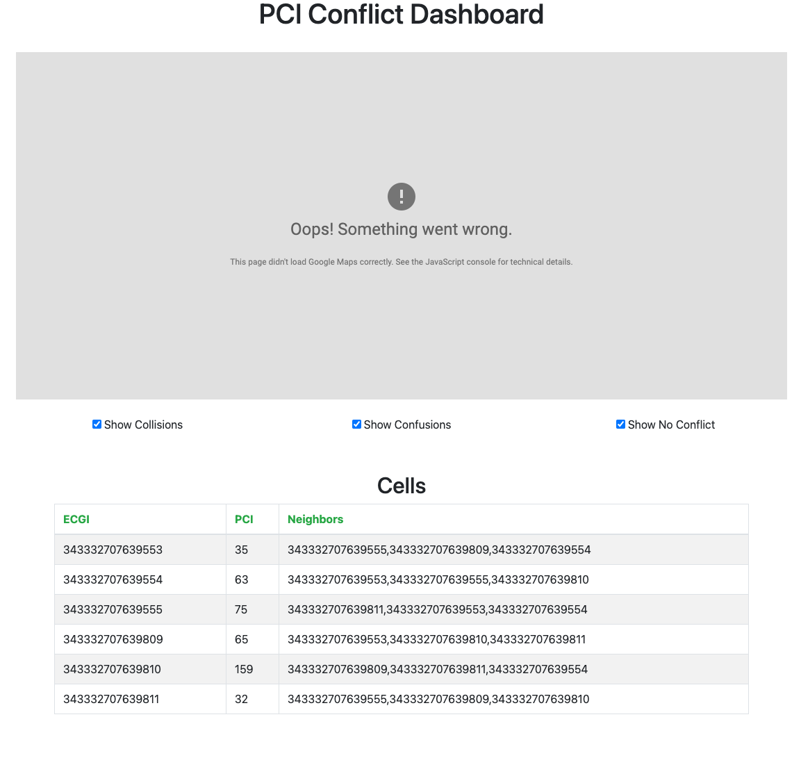
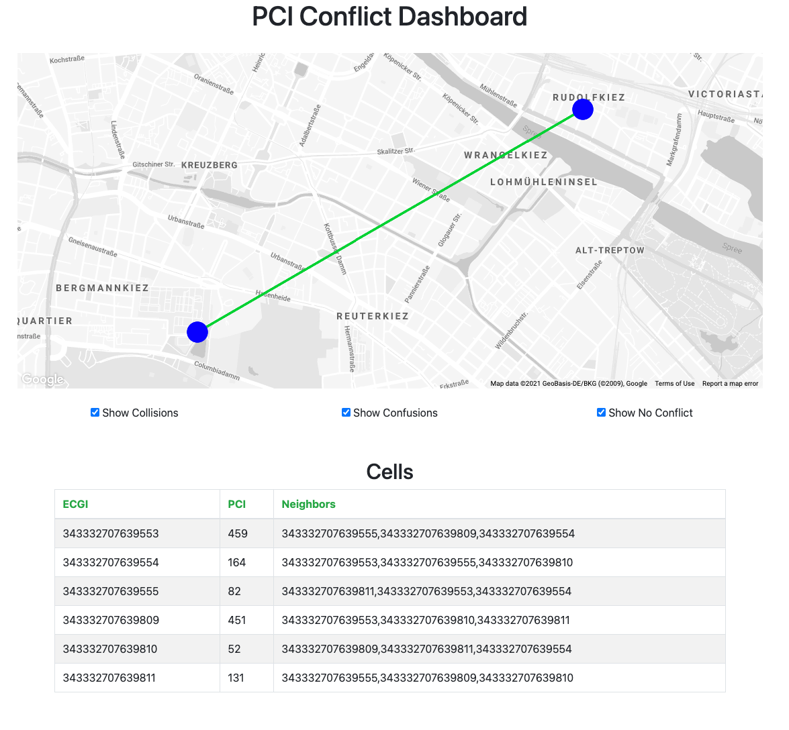

# Installation with RAN-Simulator and Facebook-AirHop xAPP
This document covers how to install ONOS RIC services with RAN-Simulator and Facebook-Airhop xAPP.
With this option, RiaB will deploy ONOS RIC services including ONOS-KPIMON-V2 (KPM 2.0 supported) together with RAN-Simulator and Facebook-AirHop xAPP.

## Clone this repository
To begin with, clone this repository:
```bash
$ git clone https://github.com/onosproject/sdran-in-a-box
```
**NOTE: If we want to use a specific release, we can change the branch with `git checkout [args]` command:**
```bash
$ cd /path/to/sdran-in-a-box
$ git checkout v1.0.0 # for release 1.0
$ git checkout v1.1.0 # for release 1.1
$ git checkout v1.1.1 # for release 1.1.1
$ git checkout master # for master
```

## Deploy RiaB with RAN-Simulator and Facebook-AirHop xAPP
To deploy RiaB with RAN-Simulator and Facebook-AirHop xAPP, we should go to `sdran-in-a-box` directory and command below:
```bash
$ cd /path/to/sdran-in-a-box
# type one of below commands
# for "latest" version
$ make-fbah # or make riab-fbah-latest
# for "master-stable" version
$ make riab-fbah-master-stable
# for a specific version
$ make riab-fbah-v1.1.0 # for release SD-RAN 1.1
$ make riab-fbah-v1.1.1 # for release SD-RAN 1.1.1
# for a "dev" version
$ make riab-fbah-dev
```

Once we push one of above commands, the deployment procedure starts.

### Credentials
In the deployment procedure, we should type some credentials on the prompt:
* OpenCORD username and HTTPS key
* GitHub username and password
* Aether/SD-RAN Helm chart repository credentials

```bash
aether-helm-chart repo is not in /users/wkim/helm-charts directory. Start to clone - it requires HTTPS key
Cloning into '/users/wkim/helm-charts/aether-helm-charts'...
Username for 'https://gerrit.opencord.org': <OPENCORD_GERRIT_ID>
Password for 'https://<OPENCORD_GERRIT_ID>@gerrit.opencord.org': <OPENCORD_GERRIT_HTTPS_KEY>
remote: Total 1103 (delta 0), reused 1103 (delta 0)
Receiving objects: 100% (1103/1103), 526.14 KiB | 5.31 MiB/s, done.
Resolving deltas: 100% (604/604), done.
sdran-helm-chart repo is not in /users/wkim/helm-charts directory. Start to clone - it requires Github credential
Cloning into '/users/wkim/helm-charts/sdran-helm-charts'...
Username for 'https://github.com': <ONOSPROJECT_GITHUB_ID>
Password for 'https://<ONOSPROJECT_GITHUB_ID>@github.com': <ONOSPROJECT_GITHUB_PASSWORD>
remote: Enumerating objects: 19, done.
remote: Counting objects: 100% (19/19), done.
remote: Compressing objects: 100% (17/17), done.
remote: Total 2259 (delta 7), reused 3 (delta 2), pack-reused 2240
Receiving objects: 100% (2259/2259), 559.35 KiB | 2.60 MiB/s, done.
Resolving deltas: 100% (1558/1558), done.

.....

helm repo add incubator https://kubernetes-charts-incubator.storage.googleapis.com/
"incubator" has been added to your repositories
helm repo add cord https://charts.opencord.org
"cord" has been added to your repositories
Username for ONF SDRAN private chart: <SDRAN_PRIVATE_CHART_REPO_ID>
Password for ONF SDRAN private chart: <SDRAN_PRIVATE_CHART_REPO_PASSWORD>
"sdran" has been added to your repositories
touch /tmp/build/milestones/helm-ready
```

If we don't see any error or failure messages, everything is deployed.
```bash
$ kubectl get po --all-namespaces
NAMESPACE     NAME                                          READY   STATUS    RESTARTS   AGE
default       router                                        1/1     Running   0          44h
kube-system   atomix-controller-694586d498-pndsn            1/1     Running   0          96s
kube-system   cache-storage-controller-5996c8fd45-wc8hz     1/1     Running   0          95s
kube-system   calico-kube-controllers-86d8c59b9f-vpztg      1/1     Running   0          45h
kube-system   calico-node-jxqp6                             1/1     Running   0          45h
kube-system   config-operator-69f7498fb5-nglg2              1/1     Running   0          95s
kube-system   coredns-dff8fc7d-9fw8d                        1/1     Running   0          45h
kube-system   dns-autoscaler-5d74bb9b8f-6mvnv               1/1     Running   0          45h
kube-system   kube-apiserver-node1                          1/1     Running   0          45h
kube-system   kube-controller-manager-node1                 1/1     Running   0          45h
kube-system   kube-multus-ds-amd64-d6v5q                    1/1     Running   0          45h
kube-system   kube-proxy-rsfvr                              1/1     Running   0          45h
kube-system   kube-scheduler-node1                          1/1     Running   0          45h
kube-system   kubernetes-dashboard-667c4c65f8-cdcqz         1/1     Running   0          45h
kube-system   kubernetes-metrics-scraper-54fbb4d595-ffd4g   1/1     Running   0          45h
kube-system   nodelocaldns-lbhf2                            1/1     Running   0          45h
kube-system   raft-storage-controller-7755865dcd-bdjkf      1/1     Running   0          96s
kube-system   topo-operator-558f4545bd-h4pds                1/1     Running   0          94s
riab          ah-eson-test-server-67495c98d8-8vqth          1/1     Running   0          71s
riab          fb-ah-gui-9dc8c86dc-zpmw5                     1/1     Running   0          71s
riab          fb-ah-xapp-7c4f7466fb-n5qg4                   1/1     Running   0          71s
riab          onos-cli-6655c68cb4-l8f76                     1/1     Running   0          71s
riab          onos-config-59884c6766-d9v4z                  2/2     Running   0          71s
riab          onos-consensus-db-1-0                         1/1     Running   0          71s
riab          onos-e2sub-7588dcbc7b-rnvdk                   1/1     Running   0          71s
riab          onos-e2t-56549f6648-d9zsf                     1/1     Running   0          70s
riab          onos-kpimon-v2-846f556cfb-pgrcf               1/1     Running   0          71s
riab          onos-pci-85f465c9cf-szlgw                     1/1     Running   0          71s
riab          onos-topo-5df4cf454c-hj7sz                    1/1     Running   0          71s
riab          ran-simulator-b6754dc97-f679m                 1/1     Running   0          71s
```

NOTE: If we see any issue when deploying RiaB, please check [Troubleshooting](./troubleshooting.md)

## End-to-End (E2E) tests for verification
In order to check whether everything is running, we should conduct some E2E tests and check their results.
Since RAN-Sim does only generate SD-RAN control messages, we can run E2E tests on the SD-RAN control plane.

### The E2E test on SD-RAN control plane
* `make test-kpimon-v2`: for SD-RAN release 1.1, release 1.1.1, master-stable, latest, and dev versions
```bash
$ make test-kpimon-v2
*** Get KPIMON result through CLI ***
PlmnID    egNB ID   Cell ID           Time         RRC.Conn.Avg   RRC.Conn.Max   RRC.ConnEstabAtt.Tot   RRC.ConnEstabSucc.Tot   RRC.ConnReEstabAtt.HOFail   RRC.ConnReEstabAtt.Other   RRC.ConnReEstabAtt.Tot   RRC.ConnReEstabAtt.reconfigFail
1279014   5153      343332707639553   23:25:28.0   5              5              0                      0                       0                           0                          0                        0
1279014   5153      343332707639554   23:25:28.0   5              5              0                      0                       0                           0                          0                        0
1279014   5154      343332707639809   23:25:28.0   5              5              0                      0                       0                           0                          0                        0
1279014   5153      343332707639555   23:25:28.0   5              5              0                      0                       0                           0                          0                        0
1279014   5154      343332707639810   23:25:28.0   5              5              0                      0                       0                           0                          0                        0
1279014   5154      343332707639811   23:25:28.0   5              5              0                      0                       0                           0                          0                        0
```

* Use Facebook-AirHop GUI page: for SD-RAN release 1.1, release 1.1.1, master-stable, latest, and dev versions

To access GUI, we should open web browser like [Chrome](https://www.google.com/chrome/) or [Safari](https://www.apple.com/safari/).
Next, go to `http://<RiaB server IP address>:30095`
Then, we can see the xAPP webpage.



On this page, we can see the `Cells` table which shows ECGI, PCI, and each cell's neighbor cells.

If we want to see the Google Map View, we should make a SSH tunnel from our local machine to the RiaB server with below command:
```bash
$ ssh <id>@<RiaB server IP address> -L "*:8080:<RiaB server IP address>:30095"
```
After that, go to `http://localhost:8080` on the web browser.



Since the Google Map API only allows us to use the url `localhost:8080` to show Google Map view, we should make the SSH tunnel.

NOTE 1: Of course, all other port forwarding should work as long as we can access the GUI with `localhost:8080` URL.

## Other commands
### Reset and delete RiaB environment
If we want to reset our RiaB environment or delete RiaB compoents, we can use below commands:
* `make reset-test`: It deletes ONOS RIC services and RAN-Simulator but Kubernetes is still running
* `make clean`: It just deletes Kubernets environment; Eventually, all ONOS RIC and RAN-Simulator are terminated; The Helm chart directory is not deleted
* `make clean-all`: It deletes all including Kubernetes environment, all componentes/PODs which RiaB deployed, and even the Helm chart directory

### Deploy or reset a chart/service
If we want to only deploy or reset a chart/service, we can use below command:
* `make atomix`: It deploys Atomix controllers
* `make reset-atomix`: It deletes Atomix controllers
* `make ric`: It deploys ONOS RIC services
* `make reset-ric`: It deletes ONOS RIC services